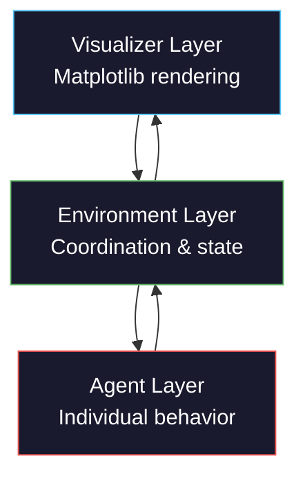
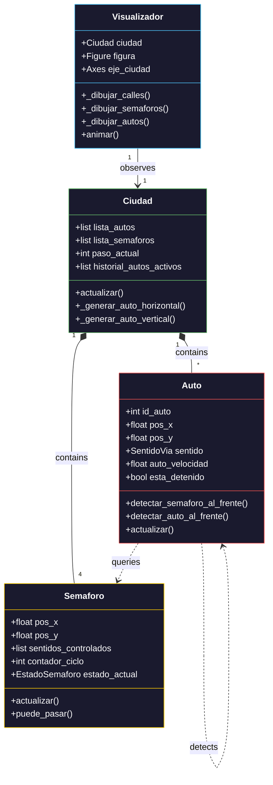

## Architectural Overview

All simulations in this project follow a **three-layer architecture** that separates concerns and promotes code reuse:



<CardGroup cols={3}>
  <Card title="Agent Layer" icon="user">
    Individual entities with autonomous decision-making
  </Card>
  <Card title="Environment Layer" icon="globe">
    Coordinates agents, manages global state, enforces rules
  </Card>
  <Card title="Visualizer Layer" icon="eye">
    Renders the simulation and displays metrics
  </Card>
</CardGroup>

## The Agent Pattern

### Core Structure

Every agent class implements this pattern:

<Tabs>
  <Tab title="Auto (Traffic)">
    ```python
    class Auto:
        # Class variable: shared across all instances
        contador_global_autos = 0
        
        def __init__(self, pos_x: float, pos_y: float, sentido: SentidoVia):
            # Unique identity
            Auto.contador_global_autos += 1
            self.id_auto = Auto.contador_global_autos
            
            # Spatial state
            self.pos_x = pos_x
            self.pos_y = pos_y
            self.sentido = sentido
            
            # Behavioral parameters
            self.auto_velocidad = VELOCIDAD_AUTO
            self.esta_detenido = False
            
            # Lifecycle flag
            self.fuera_de_pantalla = False
        
        # Perception methods
        def detectar_semaforo_al_frente(self, lista_semaforos):
            pass
        
        def detectar_auto_al_frente(self, lista_autos):
            pass
        
        # Update method: main decision loop
        def actualizar(self, lista_semaforos, lista_autos):
            pass
    ```
    **File**: `simulacion_trafico_ciudad.py:214-426`
  </Tab>
  
  <Tab title="Estudiante (Campus)">
    ```python
    class Estudiante:
        contador_id = 0
        
        def __init__(self, ubicacion_inicial, posicion_x, posicion_y):
            Estudiante.contador_id += 1
            self.id = Estudiante.contador_id
            
            # State
            self.ubicacion_actual = ubicacion_inicial
            self.posicion_x = posicion_x
            self.posicion_y = posicion_y
            
            # Behavioral memory
            self.tiempo_en_ubicacion = 0
            self.tiempo_minimo_permanencia = random.randint(3, 8)
        
        # Decision method
        def decidir_siguiente_ubicacion(self, entorno):
            pass
        
        # Action method
        def moverse_a(self, nueva_ubicacion, entorno):
            pass
    ```
    **File**: `simulacion_movimiento_estudiantes_universidad.py:39-141`
  </Tab>
</Tabs>

### Agent Identity

<Accordion title="Why use class-level counters for IDs?">
```python
class Auto:
    contador_global_autos = 0
    
    def __init__(self, pos_x, pos_y, sentido):
        Auto.contador_global_autos += 1
        self.id_auto = Auto.contador_global_autos
```

**Benefits**:
- Guarantees unique IDs without external ID manager
- Sequential numbering aids debugging ("Car 5 crashed")
- Class variable persists across all instances

**Pattern**: Increment BEFORE assignment ensures IDs start at 1, not 0.
</Accordion>

### Perception Methods

Agents query the environment through **perception methods**:

<CodeGroup>
```python Traffic Light Detection
def detectar_semaforo_al_frente(self, lista_semaforos: list):
    semaforo_relevante = None
    distancia_minima_encontrada = float('inf')
    
    for sem in lista_semaforos:
        # Only check lights that control my direction
        if self.sentido not in sem.sentidos_controlados:
            continue
        
        # Calculate distance in direction of travel
        if self.sentido == SentidoVia.DERECHA:
            diferencia = sem.pos_x - self.pos_x
        elif self.sentido == SentidoVia.IZQUIERDA:
            diferencia = self.pos_x - sem.pos_x
        # ... (similar for ARRIBA/ABAJO)
        
        # Only consider lights ahead within detection range
        if 0 < diferencia < DISTANCIA_DETECCION_SEMAFORO:
            if diferencia < distancia_minima_encontrada:
                distancia_minima_encontrada = diferencia
                semaforo_relevante = sem
    
    return semaforo_relevante
```

```python Collision Detection
def detectar_auto_al_frente(self, lista_autos: list) -> bool:
    MITAD_LARGO_AUTO = 0.5
    
    for otro_auto in lista_autos:
        if otro_auto.id_auto == self.id_auto:
            continue  # Don't compare to self
        
        # Calculate distances in travel direction and perpendicular
        if self.sentido == SentidoVia.DERECHA:
            diferencia_eje = (otro_auto.pos_x - MITAD_LARGO_AUTO) - \
                           (self.pos_x + MITAD_LARGO_AUTO)
            diferencia_lateral = abs(otro_auto.pos_y - self.pos_y)
        # ... (similar for other directions)
        
        # Blocking if: ahead, within safety distance, same lane
        if (-0.1 < diferencia_eje < DISTANCIA_SEGURIDAD and
                diferencia_lateral < TOLERANCIA_LATERAL):
            return True
    
    return False
```

```python Occupancy Sensing
def decidir_siguiente_ubicacion(self, entorno):
    self.tiempo_en_ubicacion += 1
    
    # Must stay minimum time
    if self.tiempo_en_ubicacion < self.tiempo_minimo_permanencia:
        return self.ubicacion_actual
    
    # Check current location crowding
    nivel_ocupacion_actual = entorno.obtener_nivel_ocupacion(
        self.ubicacion_actual
    )
    
    # Comfortable? Stay with 70% probability
    if nivel_ocupacion_actual < 0.7 and random.random() < 0.7:
        return self.ubicacion_actual
    
    # Find least crowded alternative
    mejor_ubicacion = None
    menor_ocupacion = 1.0
    
    for ubicacion in UbicacionCampus:
        ocupacion = entorno.obtener_nivel_ocupacion(ubicacion)
        if ocupacion < menor_ocupacion:
            menor_ocupacion = ocupacion
            mejor_ubicacion = ubicacion
    
    return mejor_ubicacion
```
</CodeGroup>

<Note>
**Design principle**: Agents receive full lists (all traffic lights, all cars) but only perceive what's relevant to their decision. This mirrors real-world **limited perception**.
</Note>

## The Environment Pattern

### Responsibilities

The environment class orchestrates the entire simulation:

```python
class Ciudad:  # Traffic simulation environment
    def __init__(self):
        # 1. Registry: track all entities
        self.lista_autos = []
        self.lista_semaforos = []
        
        # 2. Infrastructure: create traffic lights
        self._crear_semaforos()
        
        # 3. Spawn control: when to create new agents
        self.pasos_desde_ultimo_auto_horizontal = 0
        self.intervalo_generacion = 22
        
        # 4. Metrics: track system state
        self.total_autos_creados = 0
        self.historial_autos_activos = []
        
    def actualizar(self):
        # Main simulation loop
        pass
```

**File**: `simulacion_trafico_ciudad.py:432-654`

### The Update Loop

The environment's `actualizar()` method defines the **simulation heartbeat**:

<Steps>
  <Step title="Update Infrastructure">
    ```python
    self.paso_actual += 1
    
    # Advance all traffic lights
    for semaforo in self.lista_semaforos:
        semaforo.actualizar()
    ```
    Traffic lights cycle through their phases independently.
  </Step>
  
  <Step title="Update All Agents">
    ```python
    # Each agent perceives and acts
    for auto in self.lista_autos:
        auto.actualizar(self.lista_semaforos, self.lista_autos)
    ```
    Pass full context to each agent for decision-making.
  </Step>
  
  <Step title="Remove Completed Agents">
    ```python
    cantidad_antes = len(self.lista_autos)
    self.lista_autos = [
        a for a in self.lista_autos 
        if not a.fuera_de_pantalla
    ]
    cantidad_despues = len(self.lista_autos)
    self.total_autos_completados += (cantidad_antes - cantidad_despues)
    ```
    Clean up agents that left the simulation space.
  </Step>
  
  <Step title="Spawn New Agents">
    ```python
    self.pasos_desde_ultimo_auto_horizontal += 1
    
    if self.pasos_desde_ultimo_auto_horizontal >= self.intervalo_generacion:
        self._generar_auto_horizontal()
        self.pasos_desde_ultimo_auto_horizontal = 0
    ```
    Maintain agent population at desired density.
  </Step>
  
  <Step title="Record Metrics">
    ```python
    total_activos = len(self.lista_autos)
    total_parados = sum(1 for a in self.lista_autos if a.esta_detenido)
    self.historial_autos_activos.append(total_activos)
    self.historial_autos_detenidos.append(total_parados)
    ```
    Capture system state for analysis and visualization.
  </Step>
</Steps>

<Warning>
**Critical**: All agents PERCEIVE the world state from step N, then all agents ACT to create step N+1. Never let one agent's action immediately affect another agent's perception in the same step—this creates **temporal inconsistency**.
</Warning>

### Spawn Management

<Accordion title="How controlled spawning prevents agent clustering">
```python
def _zona_entrada_libre(self, pos_x: float, pos_y: float) -> bool:
    margen_entrada = DISTANCIA_SEGURIDAD + 1.0
    for auto_existente in self.lista_autos:
        distancia = ((auto_existente.pos_x - pos_x) ** 2 +
                     (auto_existente.pos_y - pos_y) ** 2) ** 0.5
        if distancia < margen_entrada:
            return False  # Too close, don't spawn
    return True

def _generar_auto_horizontal(self):
    sentido = random.choice([SentidoVia.DERECHA, SentidoVia.IZQUIERDA])
    
    if sentido == SentidoVia.DERECHA:
        pos_x_inicial = 0.0
        pos_y_inicial = CENTRO_Y + MITAD_CALLE * 0.5
    else:
        pos_x_inicial = float(ANCHO_CUADRICULA)
        pos_y_inicial = CENTRO_Y - MITAD_CALLE * 0.5
    
    # Only spawn if entrance is clear
    if not self._zona_entrada_libre(pos_x_inicial, pos_y_inicial):
        return
    
    nuevo_auto = Auto(pos_x_inicial, pos_y_inicial, sentido)
    self.lista_autos.append(nuevo_auto)
    self.total_autos_creados += 1
```

**Two-level control**:
1. **Time-based**: Spawn attempt every `intervalo_generacion` steps
2. **Space-based**: Only spawn if entrance zone is clear

Prevents unrealistic "materialization" of cars on top of each other.
</Accordion>

## The Visualizer Pattern

### Separation of Concerns

Visualization is **completely separate** from simulation logic:

```python
class Visualizador:
    def __init__(self, ciudad: Ciudad, total_pasos: int = 300):
        self.ciudad = ciudad  # Reference to environment
        self.total_pasos = total_pasos
        
        # Create matplotlib figure and axes
        self.figura = plt.figure(figsize=(16, 8), facecolor='#1a1a2e')
        self.eje_ciudad = self.figura.add_subplot(...)
        self.eje_fluidez = self.figura.add_subplot(...)
        self.eje_densidad = self.figura.add_subplot(...)
```

**Benefits**:
- Simulation can run without visualization (headless mode)
- Easy to swap rendering backends
- Testing logic doesn't require graphics

### Rendering Pipeline

The visualizer draws the simulation state each frame:

<CodeGroup>
```python Infrastructure
def _dibujar_calles(self):
    # Draw horizontal road
    rect_horizontal = parches.FancyBboxPatch(
        (0, CENTRO_Y - ANCHO_CALLE/2),
        ANCHO_CUADRICULA,
        ANCHO_CALLE,
        facecolor='#2d2d2d',  # Asphalt color
        edgecolor='none',
        zorder=1  # Behind everything else
    )
    self.eje_ciudad.add_patch(rect_horizontal)
    
    # Draw vertical road
    rect_vertical = parches.FancyBboxPatch(
        (CENTRO_X - ANCHO_CALLE/2, 0),
        ANCHO_CALLE,
        ALTO_CUADRICULA,
        facecolor='#2d2d2d',
        zorder=1
    )
    self.eje_ciudad.add_patch(rect_vertical)
```

```python Traffic Lights
def _dibujar_semaforos(self):
    for sem in self.ciudad.lista_semaforos:
        # Draw housing
        carcasa = parches.FancyBboxPatch(
            (sem.pos_x - 0.4, sem.pos_y - 0.4),
            0.8, 0.8,
            boxstyle="round,pad=0.05",
            facecolor='#111111',
            zorder=6
        )
        self.eje_ciudad.add_patch(carcasa)
        
        # Draw colored light
        luz = plt.Circle(
            (sem.pos_x, sem.pos_y),
            radius=0.28,
            color=sem.color_visual,  # Green/Yellow/Red
            zorder=7
        )
        self.eje_ciudad.add_patch(luz)
        
        # Draw glow halo
        halo = plt.Circle(
            (sem.pos_x, sem.pos_y),
            radius=0.42,
            color=sem.color_visual,
            alpha=0.15,
            zorder=6
        )
        self.eje_ciudad.add_patch(halo)
```

```python Agents
def _dibujar_autos(self):
    for auto in self.ciudad.lista_autos:
        # Size depends on orientation
        if auto.sentido in (SentidoVia.DERECHA, SentidoVia.IZQUIERDA):
            ancho_rect = 1.0
            alto_rect = 0.55
        else:
            ancho_rect = 0.55
            alto_rect = 1.0
        
        # Highlight stopped cars with white border
        color_borde = '#FFFFFF' if auto.esta_detenido else 'none'
        grosor_borde = 1.2 if auto.esta_detenido else 0
        
        rect_auto = parches.FancyBboxPatch(
            (auto.pos_x - ancho_rect/2, auto.pos_y - alto_rect/2),
            ancho_rect, alto_rect,
            facecolor=auto.color_auto,
            edgecolor=color_borde,
            linewidth=grosor_borde,
            alpha=0.88,
            zorder=8  # On top of roads and lights
        )
        self.eje_ciudad.add_patch(rect_auto)
```
</CodeGroup>

<Info>
**Z-order layering**: Use `zorder` to control draw order in matplotlib:
- `zorder=1`: Roads (bottom layer)
- `zorder=6-7`: Traffic lights
- `zorder=8`: Cars (top layer)

Higher numbers draw on top.
</Info>

### Animation Loop

```python
def animar(self, num_frame):
    # 1. Step the simulation forward
    self.ciudad.actualizar()
    
    # 2. Clear previous frame
    self.eje_ciudad.clear()
    
    # 3. Redraw all elements
    self._dibujar_calles()
    self._dibujar_semaforos()
    self._dibujar_autos()
    self._dibujar_leyenda()
    self._configurar_eje_ciudad(num_frame)
    
    # 4. Update metrics graphs
    self._dibujar_grafico_fluidez()
    self._dibujar_grafico_densidad()
```

**File**: `simulacion_trafico_ciudad.py:1026-1103`

<Accordion title="Why clear and redraw instead of updating patches?">
**Option 1: Clear and redraw** (used here)
```python
self.eje_ciudad.clear()
for auto in self.ciudad.lista_autos:
    rect = create_rectangle(auto)
    self.eje_ciudad.add_patch(rect)
```

**Option 2: Update existing patches**
```python
for auto, patch in zip(self.ciudad.lista_autos, self.patches):
    patch.set_xy((auto.pos_x, auto.pos_y))
```

**Clear/redraw is chosen because**:
- Simpler logic when agent count changes (cars spawn/despawn)
- Easier to maintain visual consistency
- Performance acceptable for ~100 agents

For 1000+ agents, patch updating would be more efficient.
</Accordion>

## State Management

### Enumerations for Type Safety

```python
from enum import Enum

class EstadoSemaforo(Enum):
    VERDE = "VERDE"
    AMARILLO = "AMARILLO"
    ROJO = "ROJO"

class SentidoVia(Enum):
    DERECHA = "DERECHA"
    IZQUIERDA = "IZQUIERDA"
    ARRIBA = "ARRIBA"
    ABAJO = "ABAJO"

class UbicacionCampus(Enum):
    AULA = "Aula"
    BIBLIOTECA = "Biblioteca"
    CAFETERIA = "Cafetería"
```

**Advantages over strings**:
- Autocomplete in IDEs
- Type checking catches typos at development time
- Can iterate all valid values: `for ubicacion in UbicacionCampus`
- Self-documenting code

### Finite State Machines

Traffic lights use a **cyclic finite state machine**:

```python
class Semaforo:
    def __init__(self, pos_x, pos_y, sentidos_controlados, fase_inicial=0):
        self.contador_ciclo = fase_inicial
        self.duracion_ciclo = PASOS_VERDE + PASOS_AMARILLO + PASOS_ROJO
        self.estado_actual = self._calcular_estado()
    
    def _calcular_estado(self) -> EstadoSemaforo:
        if self.contador_ciclo < PASOS_VERDE:
            return EstadoSemaforo.VERDE
        elif self.contador_ciclo < PASOS_VERDE + PASOS_AMARILLO:
            return EstadoSemaforo.AMARILLO
        else:
            return EstadoSemaforo.ROJO
    
    def actualizar(self):
        self.contador_ciclo = (self.contador_ciclo + 1) % self.duracion_ciclo
        self.estado_actual = self._calcular_estado()
```

**State transitions**:
```
VERDE (40 steps) → AMARILLO (10 steps) → ROJO (50 steps) → VERDE ...
```

<Note>
**Phase offset**: Traffic lights on perpendicular roads start with different `fase_inicial` to ensure only one direction has green at a time.

```python
fase_inicial_rojo = PASOS_VERDE + PASOS_AMARILLO  # = 50

# Horizontal lights start at phase 0 (GREEN)
Semaforo(pos_x, pos_y, [SentidoVia.DERECHA], fase_inicial=0)

# Vertical lights start at phase 50 (RED)
Semaforo(pos_x, pos_y, [SentidoVia.ARRIBA], fase_inicial=fase_inicial_rojo)
```
</Note>

## Configuration & Constants

Global configuration centralizes tunable parameters:

```python
# Grid dimensions
ANCHO_CUADRICULA = 20
ALTO_CUADRICULA = 20
CENTRO_X = ANCHO_CUADRICULA // 2
CENTRO_Y = ALTO_CUADRICULA // 2

# Road geometry
ANCHO_CALLE = 3
MITAD_CALLE = ANCHO_CALLE // 2

# Traffic light timing
PASOS_VERDE = 40
PASOS_AMARILLO = 10
PASOS_ROJO = 50

# Vehicle behavior
VELOCIDAD_AUTO = 0.4
DISTANCIA_SEGURIDAD = 1.8
DISTANCIA_DETECCION_SEMAFORO = 3.0
TOLERANCIA_LATERAL = 0.65
```

**File**: `simulacion_trafico_ciudad.py:46-79`

<Accordion title="Why use constants instead of hardcoded values?">
**Bad**:
```python
if diferencia < 1.8:  # What does 1.8 mean?
    return True

if self.contador_ciclo < 40:  # Magic number
    return EstadoSemaforo.VERDE
```

**Good**:
```python
if diferencia < DISTANCIA_SEGURIDAD:
    return True

if self.contador_ciclo < PASOS_VERDE:
    return EstadoSemaforo.VERDE
```

**Benefits**:
- **Readability**: Name explains purpose
- **Maintainability**: Change value in one place
- **Experimentation**: Easy to tune parameters
- **Documentation**: Constants document design decisions
</Accordion>

## Metrics & Analysis

### Real-time Tracking

```python
class Ciudad:
    def __init__(self):
        self.historial_autos_activos = []    # Cars on screen
        self.historial_autos_detenidos = []  # Cars stopped
        self.total_autos_creados = 0         # Cumulative spawns
        self.total_autos_completados = 0     # Cars that exited
    
    def actualizar(self):
        # ... simulation logic ...
        
        # Record this step's metrics
        total_activos = len(self.lista_autos)
        total_parados = sum(1 for a in self.lista_autos if a.esta_detenido)
        self.historial_autos_activos.append(total_activos)
        self.historial_autos_detenidos.append(total_parados)
```

### Derived Metrics

Visualizer computes derived metrics for display:

```python
def _dibujar_grafico_fluidez(self):
    porcentaje_movimiento = []
    for activos, detenidos in zip(
        self.ciudad.historial_autos_activos,
        self.ciudad.historial_autos_detenidos
    ):
        if activos > 0:
            porcentaje = ((activos - detenidos) / activos) * 100
        else:
            porcentaje = 0.0
        porcentaje_movimiento.append(porcentaje)
    
    self.eje_fluidez.plot(
        range(len(porcentaje_movimiento)),
        porcentaje_movimiento,
        color='#4fc3f7',
        linewidth=1.5
    )
```

**Flow percentage** = (Moving cars / Total cars) × 100

<Info>
**Dark mode visualization**: All graphs use dark backgrounds (`#1a1a2e`, `#16213e`) with high-contrast colors (`#4fc3f7`, `#66bb6a`, `#ef5350`) optimized for readability.
</Info>

## Class Hierarchy



## Execution Flow

<Steps>
  <Step title="Initialization">
    ```python
    # Create environment
    ciudad = Ciudad()
    # ↳ Creates 4 traffic lights with synchronized phases
    # ↳ Initializes empty agent list
    # ↳ Sets up metrics tracking
    
    # Create visualizer
    visualizador = Visualizador(ciudad, total_pasos=300)
    # ↳ Creates matplotlib figure with 3 subplots
    # ↳ Stores reference to environment
    ```
  </Step>
  
  <Step title="Animation Start">
    ```python
    animacion = FuncAnimation(
        visualizador.figura,
        visualizador.animar,
        frames=300,
        interval=100  # 100ms = 10 FPS
    )
    plt.show()
    ```
  </Step>
  
  <Step title="Each Frame">
    ```python
    # 1. Simulation step
    ciudad.actualizar()
    #   ↳ Update traffic lights
    #   ↳ Each car perceives and decides
    #   ↳ Remove off-screen cars
    #   ↳ Spawn new cars if needed
    #   ↳ Record metrics
    
    # 2. Visualization update
    visualizador.animar(frame_number)
    #   ↳ Clear previous frame
    #   ↳ Draw roads
    #   ↳ Draw traffic lights
    #   ↳ Draw cars
    #   ↳ Update metric graphs
    ```
  </Step>
  
  <Step title="Frame Complete">
    Matplotlib renders the frame and waits `interval` milliseconds before next frame.
  </Step>
</Steps>

## Performance Considerations

<Accordion title="Spatial queries: O(n²) collision detection">
```python
def detectar_auto_al_frente(self, lista_autos: list) -> bool:
    for otro_auto in lista_autos:  # O(n)
        # Distance calculations...
```

Each of N cars checks N-1 other cars → **O(n²) complexity**.

**Acceptable for**:
- N < 100 agents (this project)
- Sparse environments (low collision probability)

**Optimization for N > 1000**:
- Spatial partitioning (grid cells, quadtrees)
- Only check agents in nearby cells
- Reduces to O(n·k) where k = average neighbors
</Accordion>

<Accordion title="List filtering vs. flagging">
```python
# Remove off-screen cars
self.lista_autos = [
    a for a in self.lista_autos 
    if not a.fuera_de_pantalla
]
```

**Alternative: Mark as inactive**
```python
for auto in self.lista_autos:
    if auto.fuera_de_pantalla:
        auto.activo = False

self.lista_autos = [a for a in self.lista_autos if a.activo]
```

Filtering is fine when:
- Agent count is moderate (less than 1000)
- Removals are infrequent

For frequent add/remove, use object pooling.
</Accordion>

## Next Steps

<CardGroup cols={2}>
  <Card title="Agent-Based Modeling" icon="users" href="/concepts/agent-based-modeling">
    Learn the theory behind autonomous agents and emergent behavior
  </Card>
  <Card title="Traffic Simulation" icon="car" href="/simulations/traffic-flow">
    Explore the traffic intersection simulation in detail
  </Card>
</CardGroup>